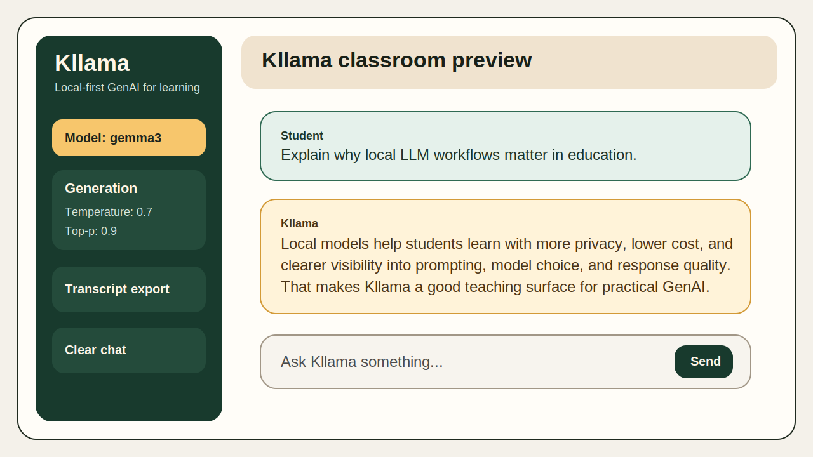

# Kllama

A simple local-first chatbot built with Streamlit and Ollama.

[](https://github.com/kunalsuri/kllama/actions/workflows/ci.yml)
[](https://opensource.org/licenses/MIT)


Kllama started two years ago as a teaching project to help students understand what a practical local GenAI application looks like: model selection, prompt steering, streaming responses, and privacy-preserving inference on your own machine. It is intentionally small, but it is still maintained.

That combination still matters. Before local LLM workflows became common, this project was already demonstrating a lightweight, private, and explainable path for working with generative AI in the classroom.

## Preview



This preview is a lightweight repository asset that shows the intended app shape. A live demo capture can replace it later, but it already gives future visitors immediate visual context.

## What Kllama Does

- Runs a local chat UI on top of Ollama.
- Streams model responses in real time.
- Lets you choose a local model from the sidebar.
- Supports a system prompt and basic generation controls.
- Exports the current chat as a Markdown transcript.

## Documentation Map

Use the shortest path for what you need:

- [README.md](README.md): project overview, installation, and first run.
- [docs/USAGE.md](docs/USAGE.md): usage notes, prompt examples, responsible AI guidance, and the AI usage declaration.
- [docs/MAINTAINING.md](docs/MAINTAINING.md): development workflow, repository layout, contributor links, and release checks.
- [CONTRIBUTING.md](CONTRIBUTING.md): pull request expectations.
- [SECURITY.md](SECURITY.md): vulnerability reporting.
- [CHANGELOG.md](CHANGELOG.md): change history.

## Quick Start

Before creating the virtual environment, verify that your Python interpreter is 3.10 or newer:

```bash
python3 --version
```

If your `python3` command is older than 3.10, use a newer interpreter such as `python3.11` when creating the virtual environment. On older macOS installs, the default `python3` can still be 3.9.

Treat code cloned from GitHub as untrusted until you have reviewed it. Best practice is to run repositories like this inside a sandboxed environment such as a disposable virtual machine, dev container, Docker container, or at minimum a dedicated Python virtual environment that does not share packages or secrets with your main setup. Do not install dependencies globally, do not run the project with `sudo`, and avoid exposing personal tokens, SSH keys, or other sensitive files inside the sandbox.

1. Install and start Ollama from [ollama.com](https://ollama.com/).
   If your platform does not start Ollama automatically, run `ollama serve` in a separate terminal.
1. Pull at least one model.

```bash
ollama pull gemma3
ollama list
```

1. Clone the repository and create a virtual environment.

```bash
git clone https://github.com/kunalsuri/kllama.git
cd kllama
python3 -m venv .venv
source .venv/bin/activate
```

On Windows PowerShell, activate the environment with:

```powershell
.venv\Scripts\Activate.ps1
```

1. Install Kllama and its runtime dependencies.

```bash
python -m pip install --upgrade pip
python -m pip install -e .
```

1. Run the app.

```bash
kllama
```

You can also use either of the direct launch commands:

```bash
python app_runner.py
streamlit run kllama.py
```

If you prefer installing from `requirements.txt`, it remains available:

```bash
python -m pip install -r requirements.txt
python app_runner.py
```

## Further Reading

- For usage notes, prompt examples, responsible AI guidance, and the AI usage declaration, see [docs/USAGE.md](docs/USAGE.md).
- For development workflow, contributor links, repository layout, and release checks, see [docs/MAINTAINING.md](docs/MAINTAINING.md).
- For release history, see [CHANGELOG.md](CHANGELOG.md) and [docs/releases/0.2.0.md](docs/releases/0.2.0.md).


---

## AI Transparency and Responsible Use


### Responsible Use of AI

- Data Privacy: Prioritize local models for processing sensitive or educational data to ensure data sovereignty.
- Human Validation: All AI-generated outputs are validated before integration into teaching, research, or decision-making workflows.
- Compliance: This project aligns with the EU Guidance on Responsible Use of Generative AI in Research [EU guidance](https://research-and-innovation.ec.europa.eu/news/all-research-and-innovation-news/guidelines-responsible-use-generative-ai-research-developed-european-research-area-forum-2024-03-20_en)

### Development Disclosure

This project was developed with assistance from the following AI tools: GitHub Copilot (Pro/Enterprise), Google's Antigravity IDE, Local Open-Weight Models (via Ollama in VS Code, e.g., Mistral). These tools were used primarily for code generation, completion, and debugging. All AI-assisted code was independently reviewed, tested, and refined by the authors. The authors take full responsibility for the correctness, security, and integrity of the codebase.

